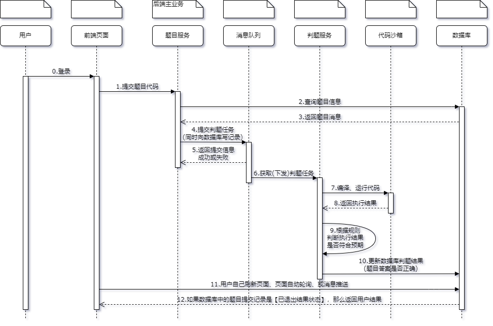

# 红隼OJ-后端

## 架构设计
* **用户服务**：提供用户登录、用户的增删改查等管理功能
* **题目服务**：提供题目的增删改查管理、题目提交功能
* **判题服务**：提供判题功能，调用代码沙箱并比对判题结果
* **代码沙箱**：提供编译执行代码、返回结果的功能
* **公共模块**：提供公共代码，比如数据模型、全局请求响应封装、全局异常处理、工具类等
* **网关服务**：提供统一的 API 转发、聚合文档、全局跨域解决等功能

### 三个核心
* 由**网关服务**集中接受前端的请求，并转发到对应的业务服务。
* **判题服务**需要调用**题目服务**获取题目信息和测试用例、调用**代码沙箱**完成代码的编译和执行并比对结果，服务间通过 Open Feign 相互调用。
* 所有服务都需要引入**公共模块**。

### 时序图

